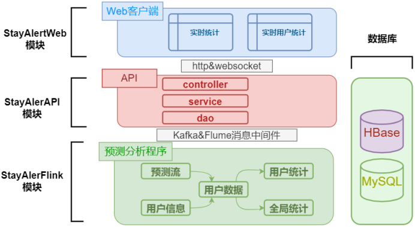
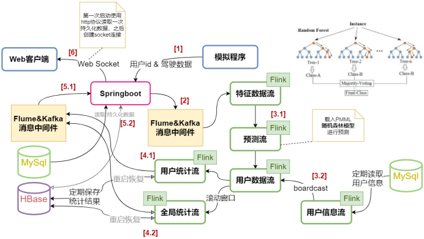
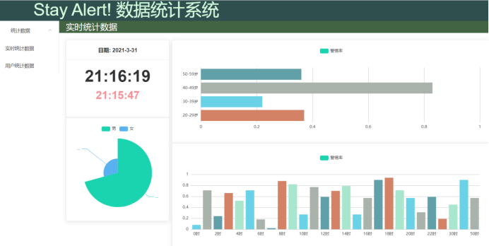

# 基于flink的分心驾驶预测与数据分析系统

## 项目简介

通过flink和随机森林模型实时识别驾驶员用户是否处于警惕状态，并进行进一步数据统计和分析，将分析结果保存在hbase，并通过Websocket向用户提供实时的分析结果。 

## 项目技术栈

后端技术栈：Flink,Flume,kafka,HBase,Mysql，Springboot 

前后端通信协议：websocket（stomp），http（前端axios） 

前端技术栈：Vue，Echart，ElementUI 

机器学习：sklearn，pmml

## 项目组成

本次项目共创建三大模块：

- **StayAlertWeb模块**：系统的Web客户端，用于展示实时的统计结果以及查询实时的用户统计数据。

- **StayAlertAPI模块**：该模块是一个Springboot程序，用于对外提供获取持久化统计数据和实时统计数据的api接口。模拟特征数据也是通过该模块的api转发到flume和kafka中间件，然后再交由预测分析程序进行处理。

- **StayAlertFlink模块**：该模块负责根据模拟特征数据预测用户的警惕状态，然后结合用户的个人信息进行用户个人的数据分析以及全局的数据分析。该模块 将统计结果发送到消息中间件中并持久化数据到hbase。StayAlertAPI模块可以从Kafka的消息队列中获取实时数据，也可以直接中hbase中获取持久化的数据。

- **数据库**：本次项目使用Mysql保持用户的个人信息，并使用HBase进行统计结果的数据持久化。

**业务流程**：

1. 模拟程序向Springboot编写的api程序发送用户模拟特征数据。
2. springboot将特征数据通过Flume和Kafka的消息中间件转发给Flink预测分析程序，形成计算流。
3. 通过connect操作将预测结果和用户信息数据合并。
   1. 预测流载入事先训练好的PMML随机森林模型进行预测。
   2. 程序从Mysql中定期读取用户信息数据，通过广播的形式向主干计算流发送数据
4. 程序将统计结果持久化到Hbase中，然后发送到Flume和Kafka消息中间件中等待Springboot程序获取并推送给用户。
   1. 根据用户id分组，统计用户个人数据
   2. 使用窗口操作和聚合函数统计全局的数据
5. Springboot向用户发送统计结果
   1. 从消息中间件中获取实时数据
   2. 从Hbase和Mysql数据库中获取持久化数据
6. Web客户端先向Springboot请求一个持久化数据进行初始的页面展示，然后创建Websocket连接，获取实时的统计结果

## 界面

# 相关下载

## 原始数据集

[数据集来源](https://www.kaggle.com/c/stayalert) 

## 分心分类模型

模型下载后放到`/StayAlertSystem/StayAlertFlink/src/main/resources`目录下。

| 名称                   | 说明           | 准确率 | 模型大小 |
| ---------------------- | -------------- | ------ | -------- |
| StayAlertRFC.pmml      | 使用88个评估器 | 87.56% | 200MB    |
| LightStayAlertRFC.pmml | 使用20个评估器 | 84.46% | 45MB     |

[百度云](https://pan.baidu.com/s/1eegMJfN3QJUDFmGR7hB80Q)  提取码：qz4x 

## 操作文档

[项目报告](https://download.csdn.net/download/xzq1207105685/16389741) 

# 数据集说明

本数据集来自Kaggle的一次竞赛，数据集由福特公司提供，该数据显示了许多组“试验”的结果，每一次试验代表持续大约2分钟的驾驶数据，这些数据在道路上或驾驶模拟器中每100毫秒记录一次，数据的特征字段包括了驾驶过程中驾驶员的生理指标，某些环境指标和车辆指标，可能出于某些考虑，这些指标的实际名称和测量单位在本任务中没有披露。

[数据集来源，同上](https://www.kaggle.com/c/stayalert) 

| **字段名称** | **字段解释**                                                 |
| ------------ | ------------------------------------------------------------ |
| TrialID      | 大约2分钟的连续数据的每个周期都有一个唯一的试验ID。例如，前1210次观察代表每100ms的连续观察，因此都有相同的试验ID |
| ObsNum       | 这是在一个试验ID内按顺序递增的数字                           |
| IsAlert      | 如果司机是警觉的为1，否则为0                                 |
| P1-P8        | 表示生理数据                                                 |
| E1-E11       | 代表环境数据                                                 |
| V1-V11       | 表示车辆数据                                                 |